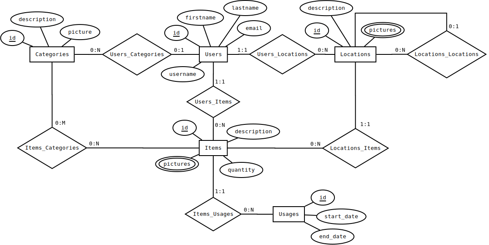

# Inventario de objetos personales - Personal Inventory

El sistema a desarrollar se trata de una aplicación Web que permita a los usuarios gestionar los distintos objetos personales (ítems) que posean.

Se debe permitir gestionar la ubicación de los mismos en las distintas ubicaciones que el usuario indique. Permitiendo además el anidamiento de tales ubicaciones en estructura de árbol.

Se debe poder además registrar múltiples ubicaciones raiz (ej: casa, trabajo, entre otras).

También se quiere llevar un registro temporal del uso de tales ítems para poder realizar estadísticas como pueden ser por ejemplo, ítems que no se utilizan hace X tiempo.

## Modelado del dominio

Cada ítem pertenece a un único usuario y se localiza en una ubicación. Del mismo se conocen un id, una descripción y una o más imágenes (opcionales). También se registran opcionalmente varias categorías (etiquetas, sin jerarquía) para el mismo.

Algunos ítems pueden además ser no-atómicos, es decir, están formados por muchos ítems pequeños e idénticos que se manejan como si fueran uno solo (ej.: agujas, alfileres, clavos, etc.). En este caso, se registra la cantidad actual del mismo.

Para gestionar el uso de un ítem, se registran las fechas de inicio y fin de cada utilización del mismo. Las estadísticas se realizarán contando días, sin detallar por horario (ej.: si una fecha de fin coincide con la de inicio, simplemente se toma que el ítem fue utilizado ese día).

* Item:
  * Id
  * Description
  * Pictures
  * Categories
  * Location
  * User

* NonAtomicItem: Item
  * Quantity

* Usage:
  * Item
  * StartDate
  * EndDate

De cada usuario se registra un id, el nombre y apellido, un e-mail y el nombre de usuario.

* User:
  * Id
  * FirstName
  * LastName
  * Email
  * Username

Cada ubicación pertenece a un único usuario. De la misma se registra un id, una descripción, una ubicación padre opcional (nula en caso de una ubicación raíz) y una o más imágenes (opcionales).

* Location:
  * Id
  * Parent
  * Description
  * Pictures
  * User

En cuanto a las categorías de ítems, éstas son codificadas, teniendo opcionalmente una imagen/ícono descriptiva de la misma, y permitiendo además la generación de categorías creadas por el usuario. Por lo tanto, de las mismas se registra un id, una descripción, una imagen/ícono (opcional) y un usuario creador (opcional).

* Category:
  * Id
  * Description
  * Picture
  * Creator

### Modelo de dominio

### Diagrama Entidad-Relación

