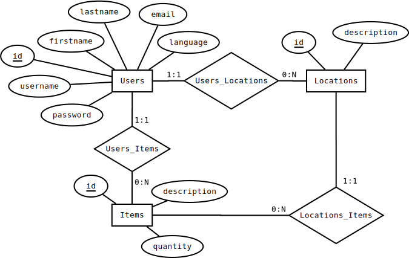

# Inventario de objetos personales - Personal Inventory

El sistema a desarrollar se trata de una aplicación Web que permita a los usuarios gestionar los distintos objetos personales (ítems) que poseeen.

Se debe permitir gestionar la ubicación de los mismos en las distintas ubicaciones que el usuario indique y permitir cambiar los ítems de ubicación si el usuario así lo desea.

## Modelado del dominio

Cada ítem pertenece a un único usuario y se localiza en una ubicación. Del mismo se conocen un id y una descripción.

Algunos ítems pueden además ser no-atómicos, es decir, están formados por muchos ítems pequeños e idénticos que se manejan como si fueran uno solo (ej.: agujas, alfileres, clavos, etc.). En este caso, se registra la cantidad actual del mismo.

* ItemModel:
  * id
  * description
  * owner_id
  * location_id
  * quantity (opcional)

De cada usuario se registra un id, el nombre y apellido, el e-mail, el idioma, el nombre de usuario y una contraseña.

* UserModel:
  * id
  * firstname
  * lastname
  * email
  * language
  * username
  * password

Cada ubicación pertenece a un único usuario. De la misma se registra un id y una descripción.

* LocationModel:
  * id
  * description
  * owner_id

### Modelo de dominio

### Diagrama Entidad-Relación

### Reglas de negocio

#### Usuarios

1. Los campos nombre, apellido, e-mail, idioma, nombre de usuario y contraseña son requeridos.
2. Nombre y el apellido:
  * Longitud de al menos 2 caracteres y no más 40.
3. E-mail:
  * Longitud de al menos 3 caracteres y no más de 50.
  * Debe tener un formato de e-mail válido.
  * Debe ser único entre todos los usuarios.
4. Nombre de usuario:
  * Longitud de al menos 5 caracteres y no más de 50.
  * Debe ser único entre todos los usuarios.
5. Contraseña:
  * Longitud de al menos 6 caracteres y no más de 30.

#### Ubicaciones

1. Los campos id de propietario y descripción son requeridos.
2. Id de propietario:
   * Debe ser un id de un usuario registrado.
3. Descripción:
   * Longitud de al menos 3 caracteres y no más de 50.
   * Debe ser única entre las ubicaciones del usuario.

#### Ítems

1. Los campos id de propietario, id de ubicación y descripción son requeridos.
2. Id de propietario:
   * Debe ser un id de un usuario registrado.
3. Id de ubicación:
   * Debe ser un id de una ubicación registrada del usuario propietario.
4. Descripción:
  * Longitud de al menos 3 caracteres y no más de 50.
  * Debe ser única entre los ítems del usuario.
